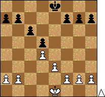

**1. e4 c6 2. d4 d5 3. ed cd 4. Сd3 Кc6 5. c3**

{: .pull-left}

Пешечная структура на диаграмме называется *«Карлсбадская структура»*. Она привлекла к себе внимание после международного турнира в Карлсбаде в 1923 г. У черных — лишняя пешка на ферзевом фланге, и цепь расположена по полям d5-c6-b7-a7 (a6). У белых — полуоткрытая линия «c». Такая пешечная конфигурация может создаться в отказанном ферзевом гамбите, защите Грюнфельда, защите Нимцовича, разменном варианте защиты Каро-Канн. *В Каро-Канн карлсбадская структура возникает с переменой цвета, поэтому планы сторон являются зеркальным отражением тех, что будут рассмотрены ниже.*
{: .clearfix}

При данной пешечной структуре возможны следующие планы.

**За белых:**

1. *Атака пешечного меньшинства*

   Типовой стратегический прием, идея которого состоит в ослаблении пешечной структуры соперника (при этом наступление проводится на том фланге, где у противника на одну пешку больше, откуда и происходит название этого приема). Белые организуют наступление на пешечную цепь черных a7-b7-c6-d5 путем продвижения пешки «b» до поля b5 (в случае расположения черной пешки на a6, поддерживая это продвижение путем a2-a4). В случае успешного проведения этого плана белым удается создать у черных слабости в пешечном расположении и осуществить вторжение своих фигур в лагерь противника.

2. *Атака центра путем e3-e4*

   При проведении плана необходимо помнить о пешке d4 и о возможности контратакующего продвижения c6-c5 (особенно если пешка «e» встала на e5). Как правило, без поддержки пешки «f» это происходит в тех, довольно редких случаях, когда соперник отстал в развитии или далеко выдвинул пешки ферзевого фланга. Более распространенным является предварительное f2-f3, и лишь затем играют e3-e4, с тем чтобы при размене de, fe помимо захвата центра использовать полуоткрытую линию «f» для атаки на королевском фланге. Если же соперник не идет на этот размен, то возможна пешечная атака на позицию его рокировки.

3. *Фигурная атака белых на ферзевом фланге (при черной пешке на a6)*

   Если при карлсбадской пешечной структуре у черных сделан ход a7-a6, то это серьезно ослабляет пункт b6 в их лагере, и белые могут, не двигая b2-b4, организовать фигурную атаку на пункты c5, b6, b7. Характерным признаком этой атаки является перевод коня Кc3-a4 с атакой полей c5 и b6.

4. *Атака на королевском фланге при односторонних рокировках. План Юсупова*

   План Юсупова, прежде всего, предполагает пешечный штурм королевских бастионов: пешка «f» задвигается на f5, после чего начинается наступление пешки «g», а если потребуется, и пешки «h», поддержанное с тыла фигурами белых. В схемах, при которых применяется план Юсупова, поле e4 недоступно для черных и часто используется белыми для подрыва центра.

5. *Атака на королевском фланге при разносторонних рокировках*

   Итак, в бой с открытым забралом! Здесь все происходит как и при других пешечных структурах: обе стороны атакуют позицию рокировки соперника и выигрывает тот, кто более точен, последователен, активен и не боится разумного риска.

**За черных:**

1. *Пешечное наступление на королевском фланге*

   Пока белые таранят пешкой «b» черную пешку c6 на ферзевом фланге черных, естественно начать наступление пешкой «f» против пешки e3 на королевском, уже преследуя не только цели ослабления пешечной структуры противника, ни и прямую атаку на короля. Однако сразу заметим, временной фактор действует в пользу белых — их атака готовится и развивается гораздо быстрее. Вторым серьезным недостатком пешечного наступления черных на королевском фланге является ослабление после движения пешки «f» центрального поля e5.

2. *Фигурная атака на королевском фланге*

   Подготовка и проведение атаки пешечного меньшинства, а также давление на образовавшиеся после этого слабости ферзевого фланга черных часто требуют от белых концентрации очень серьезных сил на этом направлении. В результате у черных появляется возможность создать перевес в силах на королевском фланге и нанести там сокрушающий ответный удар.

3. *Размен белопольных слонов или «аргентинская волынка» (Котов)*

   Рассмотрим один из возможных способов возникновения карлсбадской пешечной структуры — [Разменный вариант ферзевого гамбита](../karlsbad-pawn-structure/). Несмотря на то, что, разменявшись на d5, белые вроде бы освободили узника ферзевого гамбита — белопольного слона черных, вывести его в игру совсем не просто. Поле f5 кажется недоступным, а попытку попасть этим слоном на g4 белые могут легко пресечь, сыграв h2-h3. Вот здесь и начинается длительный маневр по размену белопольных слонов (Кb8-d7-f8, g6, Кe6, Кg7, Сf5), придуманный в Аргентине в 40-х годах и поэтому окрещенный гроссмейстером Котовым «аргентинская волынка».

4. *Подрыв центра путем c6-c5*

   Непосредственно после возникновения карлсбадской пешечной структуры черным, как правило, невыгодно проводить подрыв центра путем c6-c5 (в особенности в том случае, если черная пешка «b» стоит на b7, а не на b6), так как в этом случае образуется слабая изолированная пешка на d5. Но после того, как белые, проводя атаку пешечного меньшинства, продвинут вперед свои пешки ферзевого фланга, подрыв центра путем c6-c5 (при фигурной или пешечной поддержке) на продвижение белых b4-b5 становится более актуальным, поскольку, несмотря на ослабление пешки d5, черные получают возможность захватить центр и атаковать далеко продвинутые пешки белых на ферзевом фланге. Иногда подрыв c6-c5 способствует оживлению чернопольного слона черных, так как может вскрыться диагональ a1-h8.

5. *Реакция на атаку пешечного меньшинства путем b7-b5*

   Еще одним способом противодействия атаке пешечного меньшинства является недопущение продвижения белой пешки b4-b5 путем тормозящего b7-b5 со стороны черных. После этого у черных образуется слабая пешка на c6, а у белых слабое поле на c4. Если черным удается поставить на это поле своего коня, то слабость пешки c6 станет несущественна, так как атака по линии «c» на нее будет невозможна, а конь на c4 будет для белых очень неприятен.

6. *Атака на короля при разносторонних рокировках*

**Примечание.** За подробным описанием, а также примерами, иллюстрирующими возможные планы сторон, обращайтесь к первоисточнику — *«Таинственный Карлсбад»* М. Дроздов, А. Калёнов, М. Черныш.
