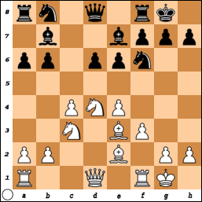

**1. e4 c5 2. Кf3 d6 3. d4 cd 4. К:d4 Кf6 5. f3** (Сыграно для того, чтобы перед выводом коня на c3 пропустить пешку на c4.) **5... e6** (Скромный ответ. Неудачно **5... d5 6. e5 Кfd7 7. f4** с ухудшенной французской защитой у черных, поэтому чаще играют **5... e5 6. Кb3 d5**.) **6. c4 b6 7. Кc3 Сb7 8. Сe3 Сe7 9. Сe2 О-О 10. О-О a6**

{: .text-center}

Теперь давайте изучим лесное животное, у которого белая пешка стоит на f3, а слон на e2.

Как обычно в Еже черные пешки с шестого ряда контролируют все поля пятого. Фигурам черным, соответственно, остается располагаться на седьмой и восьмой горизонтали. Что можно сказать при первом взгляде на эту структуру? Очевидно, слабостями черных являются пешки d6 и b6. На пешку b6 белые могут давить слоном с e3, конем с a4, а иногда ферзем с полей b3 или f2. Пешке d6, понятное дело, непременно будет угрожать белая ладья с d1, а иногда и слон с f4. С другой стороны эти же пешки являются также и силой черных! В удобный момент черные могут нанести удар d6-d5 — это оружие является основным для Ежа в целом и особенно для построения с пешкой на f3 — или даже b6-b5, что в данной схеме встречается реже, ибо слон белых с e2 всегда контролирует поле b5.

Слабости в лагере белых найти сложнее, но они есть! Как обычно, немного слаба пешка c4, на которую обычно давит черная ладья с c8. И хотя ее все время защищает слон e2, черные могут выскочить конем на e5 и удвоить натиск! Другой изъян позиции белых нематериален, а именно — черные поля на королевском фланге ослаблены в результате хода f2-f3. Как мы увидим на примере лучших партий, в случае вскрытия позиции это может пагубно сказаться на здоровье белого короля.

### Основные планы игры за белых

1. Профилактика.
2. Наступление на ферзевом фланге.
3. Атака на королевском фланге.
4. Атака в центре.

### Основные планы за черных

1. Подрыв пешечного центра белых посредством b6-b5 и d6-d5.
2. Контрудар е6-е5.
3. Активность черных на королевском фланге при помощи продвижений g7-g5 или h7-h5.
4. Типичные маршруты черных фигур.

*Литература: Шипов С.Ю. «Ёж: Учебник стратегии и тактики».*
