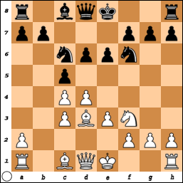

Чисто позиционный вариант, называемый в ChessBase и ряде других источников системой Хюбнера, а иногда и «стенкой»: **1. d4 Кf6 2. c4 e6 3. Кc3 Сb4 4. e3 c5 5. Сd3 Кc6 6. Кf3 Сxc3+!** (добровольный размен, не вынужденный ходом a2-a3) **7. bxc3 d6**.

{: .text-center}

Черные стремятся, даже ценой потери темпа, получить путем  **4... e5 5. d5 Кe7** блокадную позицию в духе системы Земиша, где у белых не совсем удачно расположен конь на f3, а два слона не имеют простора. К тому же помимо автоматического **0-0** у черных есть важный дополнительный ресурс — длинная рокировка, а при случае и пешая прогулка короля на ферзевый фланг.

Строго говоря, родоначальником этого метода игры был великий Нимцович. Еще в комментариях к своей исторической партии с Яновским (Петербург 1914), где было **4... b6 5. Сd3 Сb7 6. Кf3 С:c3+ 7. bc**, он рекомендовал **7... c5!** и **Кc6**. А в знаменитой партии с Ионером (Дрезден 1926) избрал **4... 0-0 5. Сd3 c5 6. Кf3 Кc6 7. 0-0 С:c3 8. bc d6** и после **9. Кd2 b6** (точнее **9... e5!**) **10. Кb3?!** (**10. f4!**) **10... e5!** добился хороших перспектив (1-я партия нашей подборки; № 95 в 1-м томе «МВП» с комментариями Г. Каспарова).

*Первоисточник: Г. Каспаров «Дебютная революция 70-х» (см. «Стенка Портиша-Хюбнера» на стр. 268 с прокомментированными партиями).*
