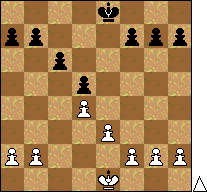

**1. d4 d5 2. c4 e6 3. Кc3 Кf6 4. cd ed**

{: .pull-left}

Под этим названием объединены варианты, в которых белые предпринимают размен в центре — **c4:d5**. После **e6:d5** пешечная структура приобретает весьма характерный рисунок, носящий название *карлсбадская структура*.

Позиции с этой пешечной формацией привлекли к себе внимание после турнира в Карлсбаде 1923 г. Подобное пешечное расположение возникает в некоторых вариантах отказанного ферзевого гамбита, в защите Нимцовича, защите Грюнфельда и других дебютах. Такая конфигурация может возникнуть и с переменой цвета, например, в разменном варианте защиты Каро-Канн (**1. e4 c6 2. d4 d5 3. ed cd 4. Сd3 Кc6 5. c3**). Некоторые участники Карлсбадского турнира 1923 г., пытаясь избежать острого Кембридж-Спрингского варианта: **1. d4 d5 2. c4 e6 3. КcЗ Кf6 4. Сg5 c6 5. e3 Кbd7 6. Кf3 Фа5!?**, избирали **6. cd**, после чего возникает пешечная структура, указанная на диаграмме. Отсюда и произошло ее название.

В наше время размен в центре обычно происходит несколько ранее, при таком порядке ходов: **1. d4 d5 2. c4 e6 3. Кc3 Кf6 4. cd ed 5. Сg5**. Играя таким образом, белые избегают острых вариантов меранской системы и системы Ботвинника.

Размениваясь на d5, белые по собственной инициативе освобождают из заточения слона c8, открывают ему дорогу на e6, f5 или g4 и как бы идут навстречу противнику. Однако, плюсы, которые они получают взамен, весьма значительны. Защита черных в разменной системе — одна из центральных проблем отказанного ферзевого гамбита.

[Подборка партий](http://www.chessgames.com/perl/chesscollection?cid=1012876), взятая за основу при подготовке.
