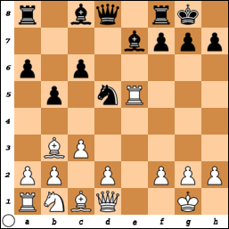

**1. e4 e5 2. Кf3 Кc6 3. Сb5 a6 4. Сa4 Кf6 5. О-О Сe7 6. Лe1 b5 7. Сb3 О-О 8. c3 d5**

Основная позиция контратаки Маршалла получается после ходов **9. ed К:d5 10. К:e5 К:e5 11. Л:d5 с6**

{: .text-center}

В известной партии Капабланка — Маршалл (Нью-Йорк, 1918), где впервые была применена вся система, черные продолжали **11... Кf6** и потерпели неудачу, не сумев пробить оборону великого кубинца. В 1938 году Маршалл ввел в практику главную линию контригры — **11... с6**, позднее детально разработанную советскими шахматистами, в том числе Спасским и Геллером. А сейчас так играют Аронян, Свидлер…

Когда бессменный чемпион США начала прошлого века сыграл так впервые против Капабланки в 1918-м году, он, конечно же, хотел заматовать великого чемпиона… Однако *«современная трактовка варианта носит совершенно другой характер. Укрепляя скромным ходом пешки позицию коня в центре, чёрные не стремятся к непосредственной атаке, а, опередив партнёра в развитии сил и вызвав у него ослабление на королевском фланге, хотят получить известную компенсацию за пешку и владеть инициативой. Как говорят в шутку некоторые гроссмейстеры, атака Маршалла в наши дни лишь ликвидирует "цвет", т.е. играющий белыми не имеет возможности проявить инициативу. Шахматистам активного, энергичного стиля, у которых испанская партия являтся "коронным" дебютом, нелегко играть против атаки Маршалла с психологической точки зрения. Можно ещё добавить, что сейчас некоторые крупные шахматисты избирают атаку Маршалла не для атаки, а для получения инициативы и огромных шансов на… ничью! Звучит парадоксально, но это так!»* — так писал в 1963-м году Игорь Бондаревский, знаменитый Фатер Спасского… Время идёт, теория углубляется, новинки применяются уже в глубоких эндшпилях. А мнение, высказанное более полувека назад, высится над океаном современной теорией непоколебимо, как скала.

Общедоступны в интернете следующие обзоры:

- [Некоторые полезные сведения о контратаке Маршалла…](http://www.crestbook.com/node/405)
- [«Дедушка» здоров! (3-я партия)](http://www.crestbook.com/?q=node/311)
- [Танцы «от печки» закончились!](http://www.chesspro.ru/events/kl04-g8.shtml)
- [1-я партия матча по быстрым шахматам Крамник — Аронян (2007)](http://www.chesspro.ru/chessonline/onlines/index_359.html)
