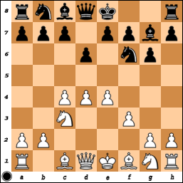

**1. d4 Кf6 2. c4 g6 3. Кc3 Сg7 4. e4 d6 5. f3 O-O 6. Сe3 c5 7. Кge2 Кc6 8. d5**

{: .pull-left style="margin-right:10px"}

Исходная позиция системы Земиша определяется на доске после ходов **1. d4 Кf6 2. c4 g6 3. Кc3 Сg7 4. e4 d6 5. f3**. По замыслу автора системы Франца Земиша белые после **5... 0-0 6. Сe3** и **Фd1-d2** готовят длинную рокировку и атакуют королевский фланг, ослабленный ходом **g7-g6**, посредством **g2-g4**, **h2-h4-h5:g6**, **Сe3-h6**, **Кc3-d5**, пытаясь устранить защитников короля. В дальнейшем с учетом найденной черными контригры стали практиковаться и иные планы.
{: .clearfix}

У черных есть три основных способа развития:

1. Атака центра в духе защиты Бенони (**6... с5**);
2. Атака центра в духе староиндийской защиты (**6... е5**);
3. Игра на ферзевом фланге (вариант Панно после **6... Кc6**).

Как правило, белые определяют положение чернопольного слона шестым ходом и мешают одному из трех планов соперника. **6. Сg5** исключает вариант **6... е5** из-за **7. de de 8. Ф:d8 Л:d8 9. Kd5**, а **6. Сe3** препятствует **6... с5**. До середины 1990-х годов считалось, что после **6. Сe3** жертва пешки ходом **6... с5** не совсем корректна, и этот ход требует подготовки ходами **6... b6** или **6... Кbd7**.

Оба подготовительных хода имеют недостатки: **6... b6** в большинстве вариантов становится потерей темпа, а **6... Кbd7** позволяет белым сыграть Кh3-f2, к тому же конь на d7 не всегда расположен удачно. Поэтому в репертуаре черных против **6. Сe3** доминировали два других плана (**6... е5** и **6... Kc6**), а ход **6... с5** применялся не чаще других второстепенных продолжений (**6... а6**, **6... b6**, **6... Kbd7** и **6... с6**).

В середине 1990-х годов оценка жертвы пешки с5 изменилась, и позиция после ходов **6. Ce3 c5 7. dc dc 8. Ф:d8 Л:d8 9. С:c5 Кc6** стала регулярно появляться в супертурнирах. Не углубляясь в теорию этого варианта, я отмечу только одно важное открытие - **10. Кd5 Кd7!**, после которого белые начали искать другие пути к перевесу. В современной практике белые иногда принимают жертву пешки, но основным вариантом стал отказанный гамбит после **7. Кge2**.

*Подробнее о планах игры после 1. d4 Кf6 2. c4 g6 3. Кc3 Сg7 4. e4 d6 5. f3 O-O 6. Сe3 c5 7. Кge2 Кc6 8. d5 можно узнать из первоисточника [«Система Земиша 6... c5 и 8. d5»](http://crestbook.com/node/1871).*
